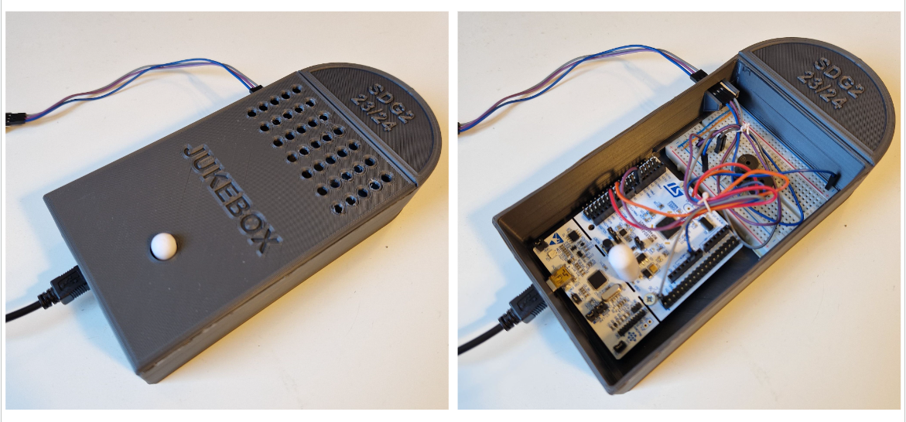

# JUKEBOX PROJECT

This projects creates a Jukebox system using a serial communication via **USART** port with an **STM32F446RE** connected to a computer, and a buzzer to play the notes.

## Authors

* **Rodrigo Tavares de Pina Simões** - email: [r.tavaresdepina@alumnos.upm.es](mailto:r.tavaresdepina@alumnos.upm.es)
* **Francisco Javier Gómez Fernández-Getino** - email: [f.gfernandez-getino@alumnos.upm.es](mailto:f.gfernandez-getino@alumnos.upm.es)

## Version 1
In this version we only focus on the **user button**. This button is connected to the pin *PC13* of the STM32F446RE. The code uses the *EXTI13* interrupt to detect the button press.

|   Parameter   |         Value         |
| ------------- | --------------------- |
| Pin           | PC13                  |
| Mode          | Input                 |
| Pull up/down  | No push no pull       |
| EXTI	        | EXTI13                |
| ISR           | EXTI15_10_IRQHandler  |
| Priority	    | 1                     |
| Subpriority	| 0                     |
| Debounce time	| 100-200 ms            |

Files added/modified in this version:
* [fsm_button.h](fsm__button_8h.html)
* [fsm_button.c](fsm__button_8c.html)
* [port_button.h](port__button_8h.html)
* [port_button.c](port__button_8c.html)
* [interr.c](interr_8c.html)

## Version 2
In this version we focus on the **USART**, adding the serial communication. The code uses the *USART3* port to receive the commands from the computer.

|   Parameter   |           Value           |
| ------------- | ------------------------- |
| Baudrate	    | 9600                      |
| Data bits	    | 8                         |
| Stop bits	    | 1                         |
| Parity	    | None                      |
| Flow control  | None                      |
| USART	        | USART3                    |
| Pins	        | PB10 (TX) and PC11 (RX)   |
| Mode	        | Alternative (both pins)   |
| Pull up/down  | Pull up (both)            |
| ISR           | USART3_IRQn               |
| Priority      | 2                         |
| Subpriority   | 0                         |

Files added/modified in this version:
* [fsm_usart.h](fsm__usart_8h.html)
* [fsm_usart.c](fsm__usart_8c.html)
* [port_usart.h](port__usart_8h.html)
* [port_usart.c](port__usart_8c.html)
* [interr.c](interr_8c.html)

## Version 3
In this version we focus on the **buzzer** that will play the notes. The duration of the notes is controlled with the *TIM2* timer. The code uses the *TIM2* interrupt to detect the end of the note.

|   Parameter   |           Value           |
| ------------- | ------------------------- |
| Pin   	    | PA6                       |
| Mode          | Alternative               |
| Pull up/down  | No pull                   |
| Timer         | TIM3                      |
| Channel       | 2                         |
| PWM Mode      | 1                         |
| Duty Cycle    | 50%                       |

Files added/modified in this version:
* [fsm_buzzer.h](fsm__buzzer_8h.html)
* [fsm_buzzer.c](fsm__buzzer_8c.html)
* [port_buzzer.h](port__buzzer_8h.html)
* [port_buzzer.c](port__buzzer_8c.html)
* [interr.c](interr_8c.html)

## Version 4
In this version we focus on the **Jukebox** as a whole by completing its FSM to interact with the user button and the serial communication. Additionally, the **sleep mode** is also configurated so that the system sleeps constantly and awakes when the button is pressed or comunnication is happening.

The commands to interact with the Jukebox are:

|    Command    |     Parameter     |                  Description                  |
| ------------- | ----------------- | --------------------------------------------- |
| play  	    | -                 | Play the current melody                       |
| pause         | -                 | Pause the current melody                      |
| stop          | -                 | Stop the current melody                       |
| next          | -                 | Play the next melody                          |
| info          | -                 | Show the information of the current melody    |
| select        | melody number (<0)| Select the melody                             |
| speed         | speed (<0)        | Change the speed of the melody                |

Osciloscope screenshot when the message "*info*" is sent from the computer and the answer "*Playing: scale*" is received:

Files added/modified in this version:
* [fsm_jukebox.h](fsm__jukebox_8h.html)
* [fsm_jukebox.c](fsm__jukebox_8c.html)
* [interr.c](interr_8c.html)
* [main.c](main_8c.html)

## Version 5

In this version we focus on **adding features** to the Jukebox. The features we added are:

* A 3D design from scratch that unifies all the parts of the system.
* An inverted scale melody that plays when the jukebox is turned off.
* A second buzzer that gives a different background melody to each of the original melodies.
* A new melody: *Twinkle Twinkle Little Star*, with a backing track.

In the following table you can see the melodies available in the jukebox, the buzzers they play at, and their respective positions in the array melodies:

|        Melody         |       Buzzer      |   Select  |
| --------------------- | ----------------- | --------- |
| scale 	            |        1/2        |     0     | 
| inv_scale             |        1/2        |     1     | 
| tetris	            |         1         |     2     | 
| tetris_back           |         2         |     2     | 
| happy_birthday        |         1         |     3     | 
| happy_birthday_back   |         2         |     3     |
| twinkle               |         1         |     4     | 
| twinkle_back          |         2         |     4     |  

Files added/modified in this version:
* [fsm_jukebox.h](fsm__jukebox_8h.html)
* [fsm_jukebox.c](fsm__jukebox_8c.html)
* [fsm_buzzer2.h](fsm__buzzer2_8h.html)
* [fsm_buzzer2.c](fsm__buzzer2_8c.html)
* [port_buzzer2.h](port__buzzer2_8h.html)
* [port_buzzer2.c](port__buzzer2_8c.html)
* [interr.c](interr_8c.html)
* [melodies.h](melodies_8h.html)
* [melodies.c](melodies_8c.html)

## Grade  
**98/100**

## Awards 
-  **Best product design**

    This student has received this badge because he has excelled in the development of the digital system. In addition, he has added several functionalities to the system, personally chosen by him, showing the development of creativity. These improvements range from FW enhancements to the integration of new HW. In addition, this student has stood out from the others in that its development has been conceived and developed as an integrated product in terms of usability, operation and features. Congratulations on your excellent work on this outstanding project! This digital badge acknowledges your skill, effort, and dedication. Keep up the great work and strive for new achievements in your academic and professional journey!

    
    

## Course Description 
Digital Systems II is a massive laboratory course of the 3rd year of the Bachelor's Degree of Engineering in Telecommunication Technologies and Telecommunication Services (BETTS). In this course, students worked in pairs during the semester and created complete digital system with firmware (FW) and hardware (HW) based on given specifications. The students programmed in C using the ARM CMSIS API on a STM32 microcontroller board. The system developed by them this academic year consisted of a UART-commanded melody playback system from a PC. The system in its most basic version was expected to respond to commands received according to several finite state machines (FSM), which controlled a pushbutton with SW anti-bounce, a UART serial communication, and a buzzer. The students worked with pass-through HWs that they assembled themselves and used typical lab equipment, such as oscilloscopes. In the course, they practiced various concepts: digital input/output, timers, external and internal interrupts, PWM, low-power modes, state machines and system debugging. In addition, they documented their code from scratch using Doxygen to generate a unique web API for the project.